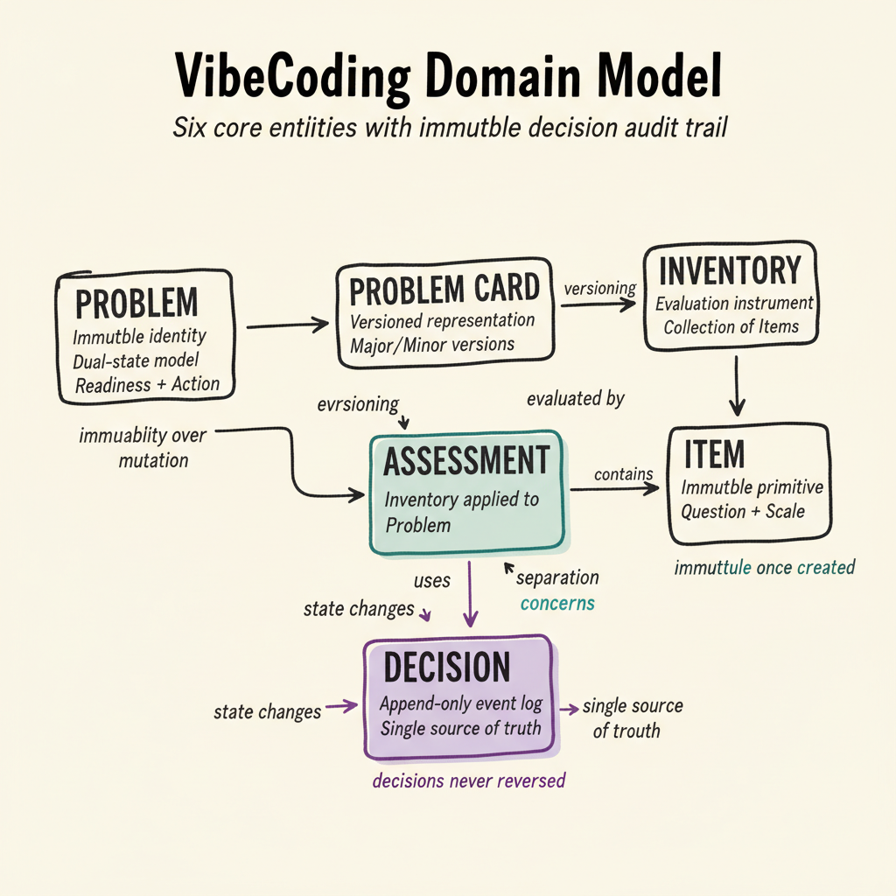
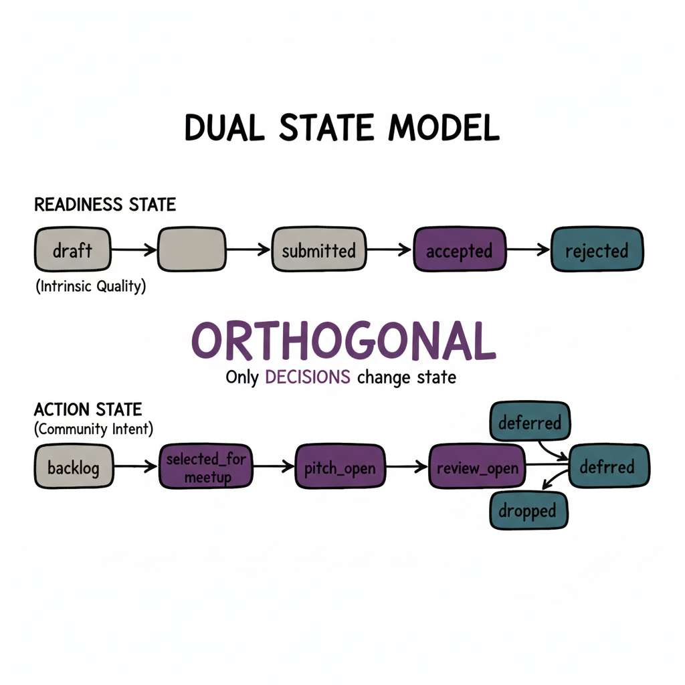
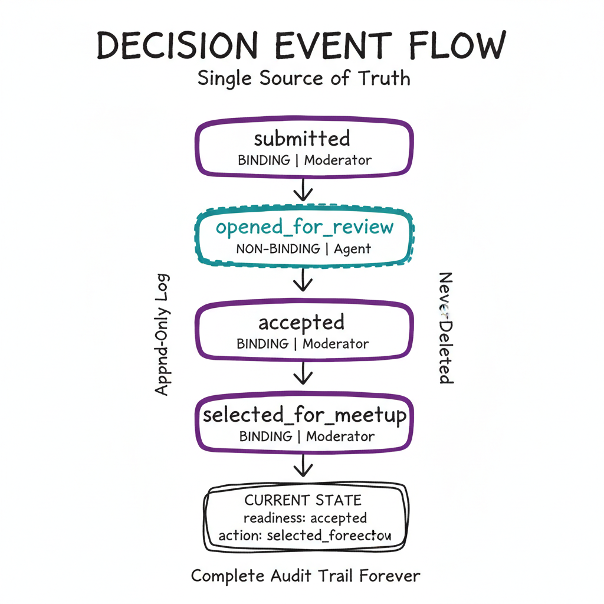
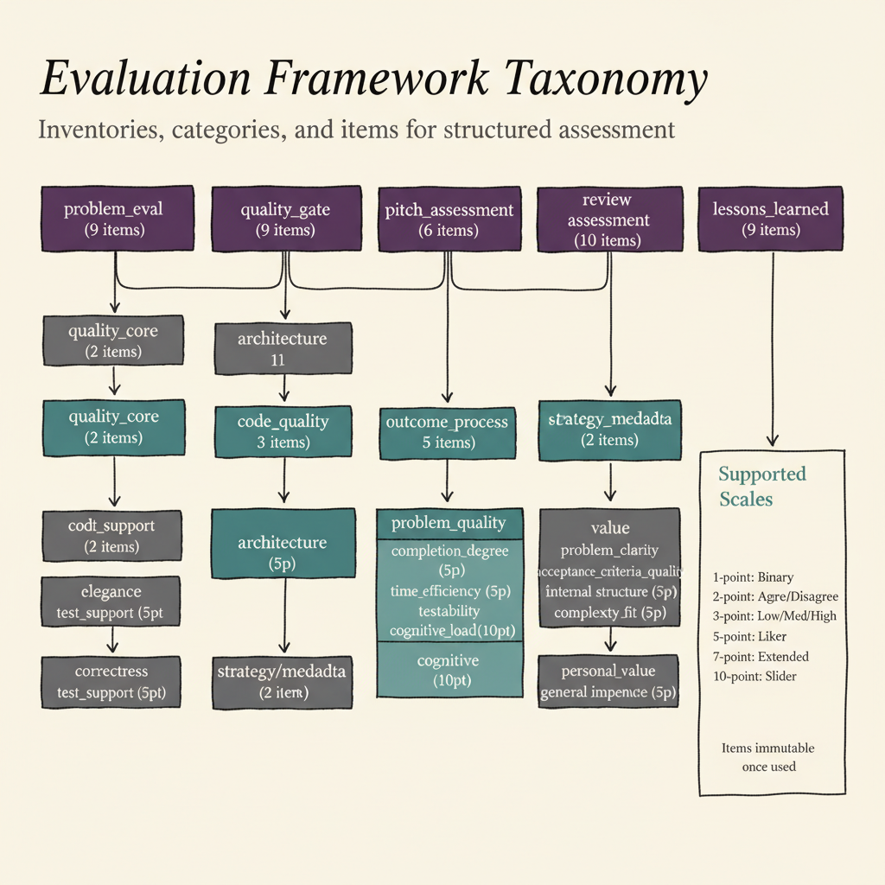
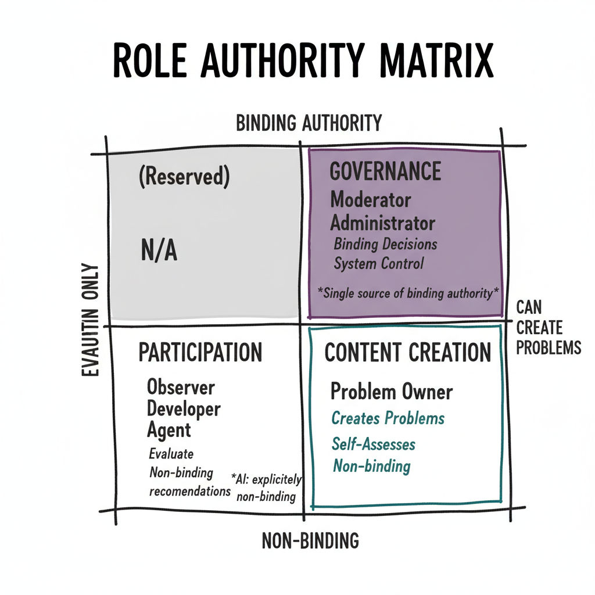
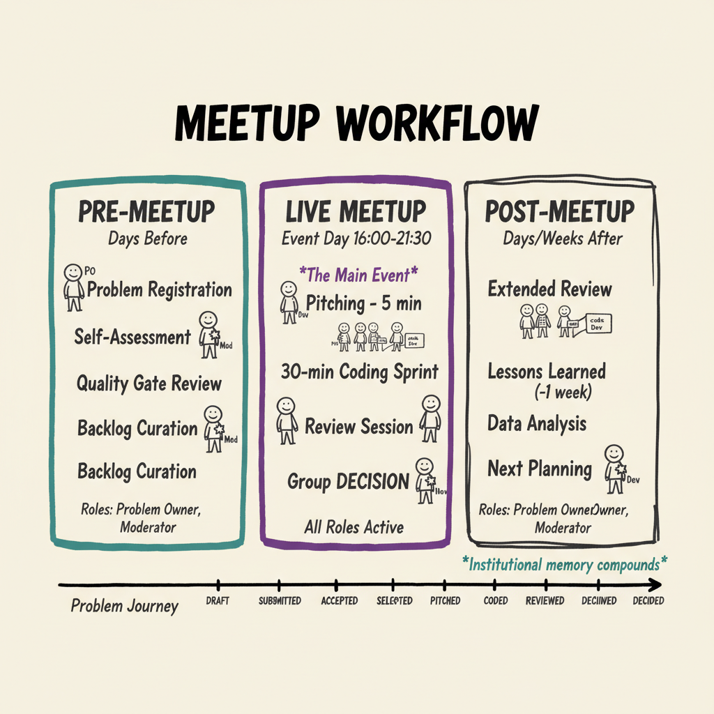

# VibeCodingProPlatform - Comprehensive Guide

> A complete reference for understanding, implementing, and contributing to the VibeCoding Professionals Meetup Platform specification.

---

## Table of Contents

1. [Executive Summary](#executive-summary)
2. [Core Philosophy](#core-philosophy)
3. [Domain Model](#domain-model)
4. [System Architecture](#system-architecture)
5. [Evaluation Framework](#evaluation-framework)
6. [User Roles & Workflows](#user-roles--workflows)
7. [Meetup Lifecycle](#meetup-lifecycle)
8. [Technical Implementation](#technical-implementation)
9. [Specification Index](#specification-index)
10. [Contributing](#contributing)

---

## Executive Summary

The **VibeCodingProPlatform** is a specification repository for a professional agentic coding meetup evaluation system. It provides the complete design for a platform that:

- **Tracks problems** submitted by practitioners for hackathon sprints
- **Captures structured evaluations** using defined quality inventories
- **Enables comparative analysis** across different agentic coding tools
- **Builds institutional memory** that compounds with each meetup

### Key Statistics

| Metric | Value |
|--------|-------|
| Specification Chapters | 27 (00-26) |
| Core Domain Objects | 6 |
| Quality Dimensions | 6 |
| Evaluation Inventories | 5 |
| User Roles | 7 |
| Decision Types | 14 |

### First Meetup

- **Date:** January 30, 2026
- **Time:** 16:00 - 21:30 CET
- **Location:** STARTPLATZ Köln, Im Mediapark 5, 50670 Köln

---

## Core Philosophy

### "Pros for Pros"

This platform embodies a philosophy of **professional practitioners helping professional practitioners**:

- **Low barriers to entry** - Email-only registration, no accounts required for participants
- **High trust** - Security by design for systemic operations, simplicity for daily use
- **Real problems** - Practitioners bring their own genuine challenges
- **Measurable quality** - Structured evaluation enables comparative learning

### Design Principles

| Principle | Description |
|-----------|-------------|
| **Immutability over Mutation** | Append-only artifacts; historical records never modified |
| **Explicitness over Implicit State** | All transitions recorded as timestamped decisions |
| **Separation of Concerns** | Content, Evaluation, and Decision-making are orthogonal |
| **Human-Centered First, Agent-Ready** | All workflows operable by humans; agents support without binding authority |
| **Transparency & Auditability** | Every action leaves explicit, traceable artifacts |

### The Bigger Vision

```
TODAY          TOMORROW              FUTURE
────────────────────────────────────────────────────────────────
Generate       Use data to           Enable specification-driven,
high-quality   optimize agentic      auditable software development
evaluation     coding tools          at scale
data           against quality
               dimensions
```

---

## Domain Model

The system centers on **six first-class domain objects** that form the conceptual backbone:



*Six core entities with immutable decision audit trail — Problems, Problem Cards, Inventories, Items, Assessments, and Decisions.*

### Core Entities

```
┌─────────────────────────────────────────────────────────────────┐
│                         DOMAIN MODEL                            │
├─────────────────────────────────────────────────────────────────┤
│                                                                 │
│   PROBLEM ──────────────────────> PROBLEM CARD                 │
│   (identity)                      (versioned representation)   │
│        │                                │                       │
│        │                                ├──> Major Versions     │
│        │                                └──> Minor Versions     │
│        │                                     (commit snapshots) │
│        │                                                        │
│        └──────────> ASSESSMENTS ──────────> INVENTORY          │
│                     (evaluations)           (instrument)       │
│                          │                       │              │
│                          │                       └──> ITEMS     │
│                          │                           (primitives)│
│                          │                                      │
│                          └──> RESPONSES (atomic data)          │
│                                                                 │
│   DECISION ─────────────────────────────────────────────────── │
│   (state changes - single source of truth, append-only)        │
│                                                                 │
└─────────────────────────────────────────────────────────────────┘
```

### Entity Descriptions

| Entity | Purpose | Key Properties |
|--------|---------|----------------|
| **Problem** | Challenge/task that can be evaluated | Immutable identity, dual-state (readiness + action) |
| **Problem Card** | Canonical representation at a point in time | Versioned (major/minor), contains metadata and repo link |
| **Inventory** | Structured collection of evaluation items | Reusable, ordered, immutable once used |
| **Item** | Evaluation primitive (question + scale) | Immutable, identified by key, versioned |
| **Assessment** | Application of Inventory to Problem | Contextual, repeatable, unlimited |
| **Decision** | Explicit act that changes state | Timestamped, attributed, append-only |

### Dual-State Model

Problems have two orthogonal state dimensions that **never collapse**:



*Readiness (intrinsic quality) and Action (community intent) evolve independently — only Decisions change state.*

**Readiness State** (Intrinsic Quality):
```
Draft ──> Submitted ──> Accepted
                   └──> Rejected
```

**Action State** (Community Intent):
```
Backlog ──> Selected for Meetup ──> Pitch Open ──> Review Open
                              └──> Deferred
                              └──> Dropped
```

---

## System Architecture



*Append-only audit trail as single source of truth — decisions are never deleted, state is always derivable.*

### Separation of Concerns

The system strictly separates three domains:

| Domain | Embodied In | Answers |
|--------|-------------|---------|
| **Content** | Problem Card + versions | "What is the problem?" |
| **Evaluation** | Assessments + responses | "How is it perceived?" |
| **Decision-making** | Decisions | "What action is taken?" |

**Key Consequence:** Evaluations never directly change state. Only Decisions do.

### Data Flow

```
CREATION FLOW
─────────────────────────────────────────────────────────────────
Problem Owner ──> Creates Problem ──> Submits (Decision)
                                 └──> Takes Self-Assessment

CURATION FLOW
─────────────────────────────────────────────────────────────────
Moderator ──> Opens Pitch Mode ──> Participants Rate
         └──> Views Results
         └──> Executes Decision (select/defer/drop)

EVALUATION FLOW
─────────────────────────────────────────────────────────────────
Assessment ──> Uses Inventory ──> Collects Responses
          └──> Records Context (role, time, location)
          └──> Never changes state directly

GOVERNANCE FLOW
─────────────────────────────────────────────────────────────────
Decision ──> Changes State ──> Creates Audit Entry
        └──> Is Binding (moderator/admin)
        └──> Is Non-Binding (agent/observer)
```

---

## Evaluation Framework



*Inventories contain Items; Assessments apply Inventories to Problems. All are reusable and immutable once used.*

### Six Quality Dimensions

The platform measures software quality across six empirically comparable dimensions:

| Dimension | Description | Scale |
|-----------|-------------|-------|
| **Correctness** | Does it work as specified? | 5-point |
| **Test Support** | Are tests present and meaningful? | 5-point |
| **Readability** | Is the code easy to understand? | 5-point |
| **Simplicity** | Is the solution appropriately simple? | 5-point |
| **Elegance** | Does it exhibit good design taste? | 5-point |
| **Extensibility** | Can it be extended without major refactoring? | 5-point |

### Five Standard Inventories

| Inventory | Purpose | Items | When Used |
|-----------|---------|-------|-----------|
| `problem_eval` | PO self-assessment | 9 | During drafting |
| `quality_gate` | Moderator pre-screening | 9 | Before acceptance |
| `pitch_assessment` | First impressions | 6 | During pitch phase |
| `review_assessment` | Post-sprint evaluation | 10 | After coding |
| `lessons_learned` | Reflection | 9 | One week later |

### Response Semantics

- **Scales:** 1, 2, 3, 5, 7, or 10 point scales
- **No forced completion:** All items optional
- **Append-only:** Responses never mutated
- **Contextual:** Every response tagged with role, time, location

---

## User Roles & Workflows



*Who can do what — binding authority (Moderator/Admin) vs. evaluation participation (all roles).*

### Role Hierarchy

```
                    ADMINISTRATOR
                         │
                         │ (inherits all)
                         ▼
                    MODERATOR
                         │
        ┌────────────────┼────────────────┐
        │                │                │
        ▼                ▼                ▼
   PROBLEM OWNER    DEVELOPER        OBSERVER
                         │
                         ▼
                  CODING PARTNER

                      AGENT
              (non-binding only)
```

### Role Capabilities

| Role | Create Problems | Assess | Make Binding Decisions | Configure System |
|------|-----------------|--------|------------------------|------------------|
| **Administrator** | Yes | Yes | Yes | Yes |
| **Moderator** | Yes | Yes | Yes | No |
| **Problem Owner** | Own only | Yes | No | No |
| **Developer** | No | Yes | No | No |
| **Observer** | No | Yes | No | No |
| **Agent** | No | Yes | No (recommendations only) | No |

### Authentication Model

| Actor Type | Authentication | Access Method |
|------------|----------------|---------------|
| Problem Owner | Email only | Private URL |
| Developer/Observer | None | Session pseudonym |
| Moderator | Email + Password | Login |
| Administrator | Email + Password | Login |
| Agent | API key | Non-binding actions |

---

## Meetup Lifecycle



*Three temporal phases — Pre-Meetup (preparation), Live Meetup (hackathon), Post-Meetup (reflection and learning).*

### Temporal Phases

```
PRE-MEETUP                LIVE MEETUP                POST-MEETUP
─────────────────────────────────────────────────────────────────
Problem         ──>       Pitching      ──>          Reflection
Registration              Review                     Extended Review
Pre-Assessment            Live Coding               Lessons Learned
Quality Gates             Live Decisions            Data Analysis
Backlog Curation          Group Consensus           Next Planning
```

### Problem Journey

```
1. DRAFT
   └─> Problem Owner creates and refines
   └─> Private URL for editing
   └─> Self-assessment available

2. SUBMITTED
   └─> Creates Major Version 1
   └─> Enters moderator queue
   └─> Quality gate assessment

3. ACCEPTED / REJECTED
   └─> Moderator decision with rationale
   └─> If accepted: enters backlog

4. SELECTED FOR MEETUP
   └─> Planned for specific event
   └─> Appears on dashboard

5. PITCHED
   └─> Live presentation
   └─> Pitch assessment open
   └─> Participants rate first impressions

6. CODED
   └─> 30-minute hackathon sprint
   └─> Multiple approaches compared
   └─> Repository activity tracked

7. REVIEWED
   └─> Review assessment open
   └─> Quality dimensions rated
   └─> Group discussion

8. DECIDED
   └─> Final status recorded
   └─> May be deferred for future
   └─> Enters historical record
```

### Selection, Deferral, and Dropping

| Outcome | Meaning | Visibility |
|---------|---------|------------|
| **Selected** | Active investment of time/effort | Primary dashboard |
| **Deferred** | Valuable but not now (with reason) | Backlog preserved |
| **Dropped** | Intentionally removed | Hidden but auditable |

---

## Technical Implementation

### Database Architecture

**Core Tables (14):**
- `users` - All actors (humans + agents)
- `sessions` - Pseudonymous browser sessions
- `meetups` - Event instances
- `problems` - Problem identity + cached state
- `problem_versions` - Immutable card versions
- `problem_repo_snapshots` - Commit hash mapping
- `inventories` - Reusable instruments
- `items` - Evaluation primitives
- `inventory_items` - Composition with order
- `assessments` - Inventory application
- `responses` - Atomic answers
- `decisions` - Event log (single source of truth)
- `comments` - Qualitative feedback
- `meetup_problem_queue` - Backlog management

### Key Design Patterns

| Pattern | Implementation | Benefit |
|---------|----------------|---------|
| **Immutability** | Append-only tables, no UPDATE/DELETE on core data | Full auditability |
| **Event Sourcing** | Decisions table as single source of truth | State reconstructable |
| **Extensible Enums** | VARCHAR + FK reference tables | No schema migrations |
| **Version Control** | Major/minor versions for problems | Longitudinal analysis |
| **Contextual Tagging** | Role, time, location on every response | Precise filtering |

### Technology Stack

| Layer | Technology |
|-------|------------|
| Frontend | SvelteKit 2.x + Tailwind CSS + Melt UI |
| Backend | SvelteKit API routes |
| Database | SQLite (MVP) → PostgreSQL (production) |
| ORM | Drizzle ORM |

---

## Specification Index

### Foundation (Chapters 00-02)

| Chapter | Topic | Key Concepts |
|---------|-------|--------------|
| [00](spec/00-foundation/00_introduction.md) | Introduction | Vision, necessity, scope |
| [01](spec/00-foundation/01_purpose_scope_and_design_principles.md) | Purpose & Principles | Design constraints, invariants |
| [02](spec/00-foundation/02_conceptual_overview.md) | Conceptual Overview | Domain objects, separation of concerns |

### Core Domain (Chapters 03-11)

| Chapter | Topic | Key Concepts |
|---------|-------|--------------|
| [03](spec/01-core-domain/03_roles_actors_and_authority_model.md) | Roles & Authority | Actor types, binding vs non-binding |
| [04](spec/01-core-domain/04_problems_and_problem_cards.md) | Problems | Dual-URL model, readiness/action states |
| [05](spec/01-core-domain/05_problem_versioning_model.md) | Versioning | Major/minor versions, rollback semantics |
| [06](spec/01-core-domain/06_repositories_and_external_references.md) | Repositories | GitHub integration, commit tracking |
| [07](spec/01-core-domain/07_inventories_and_items.md) | Inventories & Items | Evaluation instruments, immutability |
| [08](spec/01-core-domain/08_assessments.md) | Assessments | Application model, context framing |
| [09](spec/01-core-domain/09_voting_and_data_capture.md) | Voting | Atomic responses, pseudonymous sessions |
| [10](spec/01-core-domain/10_decisions_and_decision_history.md) | Decisions | State transitions, authority model |
| [11](spec/01-core-domain/11_meetup_model.md) | Meetup Model | Temporal structure, backlog management |

### User Interface (Chapters 12-18)

| Chapter | Topic | Key Concepts |
|---------|-------|--------------|
| [12](spec/02-user-interface/12_dashboards_and_system_views.md) | Dashboards | Role-sensitive views, live control |
| [13](spec/02-user-interface/13_problem_card_user_interface.md) | Problem Card UI | Public/private views, version navigation |
| [14](spec/02-user-interface/14_live_interaction_modes.md) | Live Interaction | Pitch/review modes, single-focus |
| [15](spec/02-user-interface/15_results_and_analytics.md) | Results & Analytics | Aggregation, filtering, statistics |
| [16](spec/02-user-interface/16_commenting_and_qualitative_feedback.md) | Commenting | Qualitative feedback, non-binding |
| [17](spec/02-user-interface/17_administration_interfaces.md) | Admin Interfaces | Item/inventory management |
| [18](spec/02-user-interface/18_authentication_and_access_control.md) | Auth & Access | Minimal friction model |

### Technical (Chapters 19-22)

| Chapter | Topic | Key Concepts |
|---------|-------|--------------|
| [19](spec/03-technical/19_data_model_and_persistence.md) | Data Model | PostgreSQL schema, constraints |
| [20](spec/03-technical/20_system_logs_and_traceability.md) | Logs & Traceability | Audit trail, research capability |
| [21](spec/03-technical/21_extensibility_and_future_directions.md) | Extensibility | Agent integration, automation |
| [22](spec/03-technical/22_open_questions_and_deferred_specifications.md) | Open Questions | Intentional gaps, refinement criteria |

### Appendices (Chapters 23-26)

| Chapter | Topic | Key Concepts |
|---------|-------|--------------|
| [23](spec/04-appendices/23_appendix_user_stories.md) | User Stories | 46 stories across all roles |
| [24](spec/04-appendices/24_appendix_item_inventory_bootstrap.md) | Bootstrap Data | 18 items, 5 inventories |
| [25](spec/04-appendices/25_specification_addendum_interview_findings.md) | Interview Findings | Implementation decisions |
| [26](spec/04-appendices/26_specification_addendum_UI.md) | UI Addendum | Component specifications |

---

## Contributing

### Getting Started

1. Read the [Beginner's Introduction](docs/getting-started/Beginners_Intro.md)
2. Understand the [Core Philosophy](#core-philosophy)
3. Review relevant specification chapters
4. Discuss at meetup or via issues
5. Submit PRs with proposed changes

### For Problem Owners

See [Problem Creation Best Practices](docs/getting-started/problem_creation_best_practices.md) for:
- How to write effective problem cards
- Understanding the readiness spectrum
- Documenting your agentic tooling approach

### For Developers

The [CLAUDE.md](CLAUDE.md) file contains:
- Domain model reference
- Design principles
- Database schema overview
- AI assistant guidance

---

## Visualization Index

All diagrams are embedded inline with their relevant sections throughout this guide. For quick reference:

| # | Diagram | Section | Direct Link |
|---|---------|---------|-------------|
| 1 | **Domain Model** | [Domain Model](#domain-model) | [01-domain-model-hero.png](images/01-domain-model-hero.png) |
| 2 | **Dual-State Lifecycle** | [Domain Model](#dual-state-model) | [02-dual-state-lifecycle.png](images/02-dual-state-lifecycle.png) |
| 3 | **Decision Event Flow** | [System Architecture](#system-architecture) | [03-decision-event-flow.png](images/03-decision-event-flow.png) |
| 4 | **Evaluation Taxonomy** | [Evaluation Framework](#evaluation-framework) | [04-evaluation-taxonomy.png](images/04-evaluation-taxonomy.png) |
| 5 | **Role Authority Matrix** | [User Roles & Workflows](#user-roles--workflows) | [05-role-authority-matrix.png](images/05-role-authority-matrix.png) |
| 6 | **Meetup Workflow** | [Meetup Lifecycle](#meetup-lifecycle) | [06-meetup-workflow.png](images/06-meetup-workflow.png) |

---

*Pros for Pros. The future of software development is being written now. Let's make sure it's written well.*
