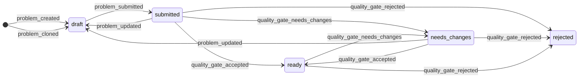
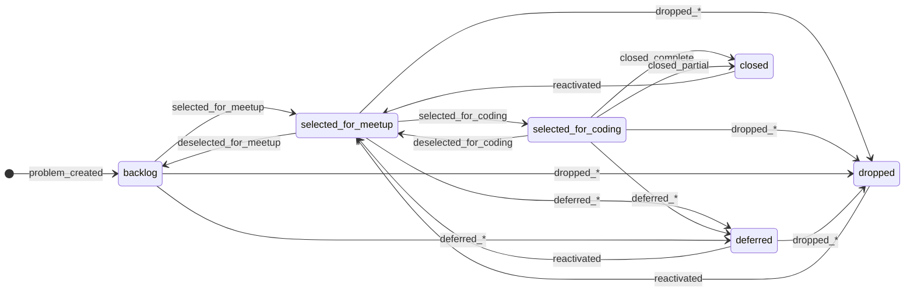
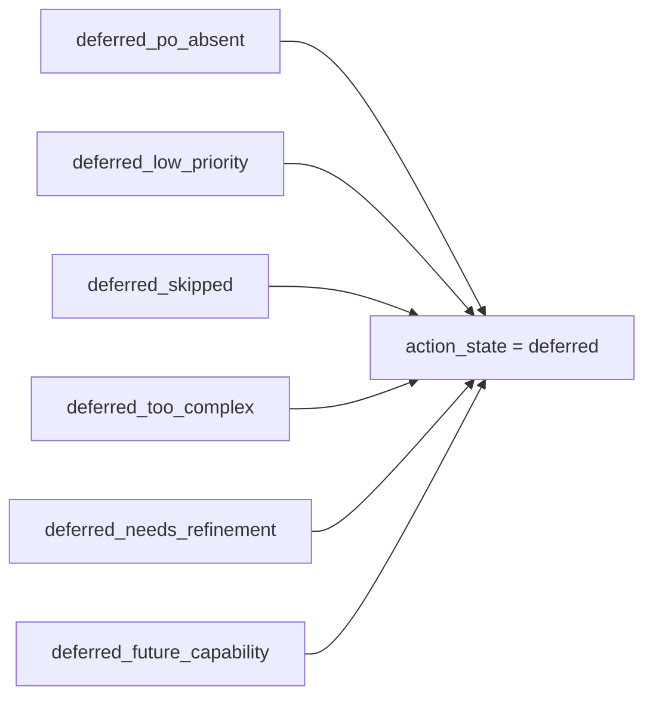

# 28. Appendix: Problem State Transition Diagram

This appendix provides a visual representation of Problem state transitions as specified in Chapter 27 and the data model in Chapter 19. The diagram uses Mermaid syntax for rendering.

**Important**: This diagram represents the **two orthogonal state dimensions** and their **decision-driven transitions**. Live orchestration modes (`pitch`, `review`, `idle`) are tracked in `meetup_live_context` and are **not shown** as they do not affect Problem states.

---

## 28.1 Readiness State Transitions

Readiness states reflect the intrinsic quality and preparedness of the Problem Card.



### Readiness State Notes

- **`draft`**: Initial state. PO can edit freely. Edits are auto-saved but not versioned.
- **`submitted`**: Version locked. Awaiting moderator review.
- **`needs_changes`**: Moderator feedback received. PO must create new major version to continue.
- **`ready`**: Quality gate passed. Eligible for meetup selection.
- **`rejected`**: Terminal state. Problem fundamentally unsuitable.

---

## 28.2 Action State Transitions

Action states reflect community intent and workflow disposition. These are **orthogonal** to readiness states.



### Action State Notes

- **`backlog`**: General pool. Available for future meetups.
- **`selected_for_meetup`**: On the agenda for an upcoming meetup.
- **`selected_for_coding`**: Actively being worked on in sprint.
- **`deferred`**: Postponed. Reason captured in decision_type (6 variants).
- **`dropped`**: Removed from consideration. Reason captured in decision_type (2 variants).
- **`closed`**: Successfully completed. Reason captured in decision_type (2 variants).

---

## 28.3 Deferral Decision Types

All deferral decisions transition `current_action_state` → `deferred`:



---

## 28.4 Live Context (Separate System)

Live orchestration is tracked in `meetup_live_context`, **not** as action states. The following decisions update live context only:

| Decision | Effect on `meetup_live_context` | Effect on Problem States |
|----------|--------------------------------|-------------------------|
| `opened_for_pitch_assessment` | `current_mode = 'pitch'`, `current_problem_id = X` | **None** |
| `closed_for_pitch_assessment` | `current_mode = 'idle'`, `current_problem_id = NULL` | **None** |
| `opened_for_review` | `current_mode = 'review'`, `current_problem_id = X` | **None** |
| `closed_for_review` | `current_mode = 'idle'`, `current_problem_id = NULL` | **None** |

This separation ensures that transient orchestration state does not pollute the Problem's durable state model.

---

## 28.5 Complete State Effect Mapping

Per `decision_state_effects` table (Ch.19.2.4):

| Decision Type | New Readiness | New Action | New Live Mode |
|---------------|--------------|------------|---------------|
| `problem_created` | draft | backlog | — |
| `problem_cloned` | draft | backlog | — |
| `problem_submitted` | submitted | — | — |
| `problem_updated` | draft | — | — |
| `quality_gate_accepted` | ready | — | — |
| `quality_gate_rejected` | rejected | — | — |
| `quality_gate_needs_changes` | needs_changes | — | — |
| `selected_for_meetup` | — | selected_for_meetup | — |
| `deselected_for_meetup` | — | backlog | — |
| `selected_for_coding` | — | selected_for_coding | — |
| `deselected_for_coding` | — | selected_for_meetup | — |
| `deferred_*` (6 types) | — | deferred | — |
| `dropped_*` (2 types) | — | dropped | — |
| `closed_*` (2 types) | — | closed | — |
| `opened_for_pitch_assessment` | — | — | pitch |
| `closed_for_pitch_assessment` | — | — | idle |
| `opened_for_review` | — | — | review |
| `closed_for_review` | — | — | idle |

(— indicates no change to that dimension)

---

## 28.6 Key Invariants Visualized

### Orthogonality of State Dimensions

```
┌─────────────────────────────────────────────────────────────────┐
│                        Problem States                            │
├─────────────────────────────┬───────────────────────────────────┤
│     Readiness (quality)     │       Action (disposition)        │
├─────────────────────────────┼───────────────────────────────────┤
│ • draft                     │ • backlog                         │
│ • submitted                 │ • selected_for_meetup             │
│ • needs_changes             │ • selected_for_coding             │
│ • ready                     │ • deferred                        │
│ • rejected                  │ • dropped                         │
│                             │ • closed                          │
├─────────────────────────────┴───────────────────────────────────┤
│                     Valid Combinations                           │
│  A Problem can be in ANY readiness state AND ANY action state   │
│  Examples:                                                       │
│  • (draft, backlog) - just created                              │
│  • (ready, selected_for_coding) - being worked on               │
│  • (needs_changes, deferred) - feedback given, waiting          │
│  • (rejected, dropped) - completely removed                     │
└─────────────────────────────────────────────────────────────────┘
```

### Binding vs. Non-Binding Decisions

```
┌─────────────────────────────────────────────────────────────────┐
│                    Decision Processing                           │
├─────────────────────────────────────────────────────────────────┤
│                                                                  │
│  Decision Created ──┬── is_binding = true ──► Update States     │
│                     │                                            │
│                     └── is_binding = false ──► Audit Trail Only │
│                                                                  │
│  Invariant: Agents ALWAYS create is_binding = false             │
│                                                                  │
└─────────────────────────────────────────────────────────────────┘
```

---

## 28.7 Relationship to Other Chapters

- **Chapter 4**: Defines the dual-state model (readiness + action)
- **Chapter 10**: Defines decision types and binding semantics
- **Chapter 11**: Defines meetup lifecycle and selection/deferral/drop semantics
- **Chapter 14**: Defines live context as separate from action states
- **Chapter 19**: Provides catalog tables and `decision_state_effects` mapping
- **Chapter 27**: Provides prose walkthrough of these transitions
