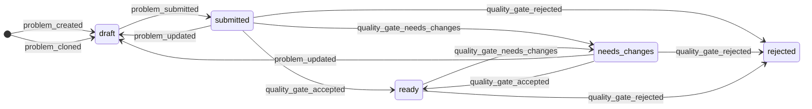
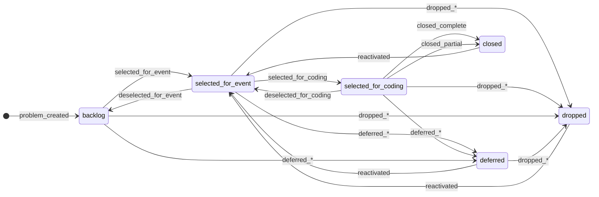
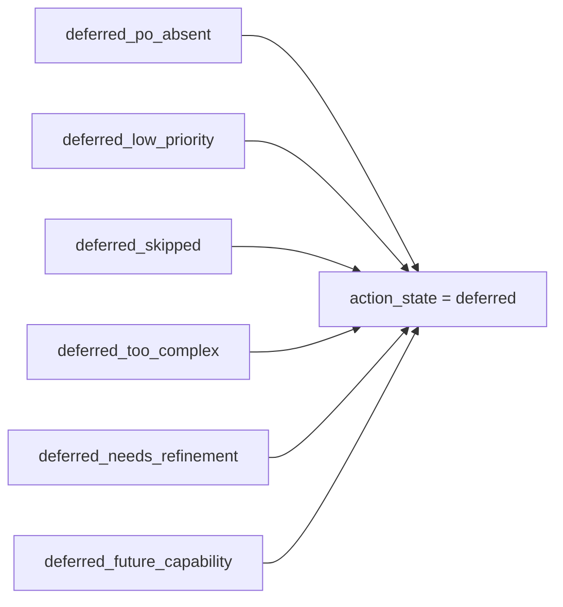
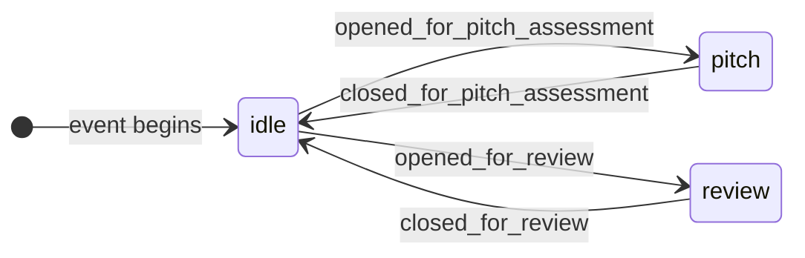
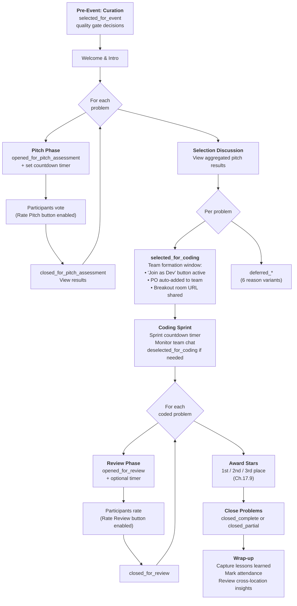

# 28. Appendix: State Transitions and Orchestration Diagrams

This appendix provides visual representations of state transitions and live event orchestration as specified in Chapters 14, 27, and the data model in Chapter 19. All diagrams use Mermaid syntax for rendering.

**Important**: Sections 28.1–28.6 cover the **two orthogonal Problem state dimensions** and their **decision-driven transitions**. Section 28.7 covers **live event orchestration**, which combines live context modes (`pitch`, `review`, `idle`) with action state transitions (`selected_for_coding`) into the moderator's operational flow.

---

## 28.1 Readiness State Transitions

Readiness states reflect the intrinsic quality and preparedness of the Problem Card.


```mermaid
stateDiagram-v2
    direction LR

    [*] --> draft: problem_created
    [*] --> draft: problem_cloned

    draft --> submitted: problem_submitted

    submitted --> draft: problem_updated
    needs_changes --> draft: problem_updated

    submitted --> ready: quality_gate_accepted
    submitted --> needs_changes: quality_gate_needs_changes
    submitted --> rejected: quality_gate_rejected

    needs_changes --> ready: quality_gate_accepted
    needs_changes --> rejected: quality_gate_rejected

    ready --> needs_changes: quality_gate_needs_changes
    ready --> rejected: quality_gate_rejected
```

### Readiness State Notes

- **`draft`**: Initial state. PO can edit freely. Edits are auto-saved but not versioned.
- **`submitted`**: Version locked. Awaiting moderator review.
- **`needs_changes`**: Moderator feedback received. PO must create new major version to continue.
- **`ready`**: Quality gate passed. Eligible for event selection.
- **`rejected`**: Terminal state. Problem fundamentally unsuitable.

---

## 28.2 Action State Transitions

Action states reflect community intent and workflow disposition. These are **orthogonal** to readiness states.


```mermaid
stateDiagram-v2
    direction LR

    [*] --> backlog: problem_created

    backlog --> selected_for_event: selected_for_event
    selected_for_event --> backlog: deselected_for_event

    selected_for_event --> selected_for_coding: selected_for_coding
    selected_for_coding --> selected_for_event: deselected_for_coding

    selected_for_event --> deferred: deferred_*
    selected_for_coding --> deferred: deferred_*
    backlog --> deferred: deferred_*

    selected_for_event --> dropped: dropped_*
    selected_for_coding --> dropped: dropped_*
    backlog --> dropped: dropped_*
    deferred --> dropped: dropped_*

    selected_for_coding --> closed: closed_complete
    selected_for_coding --> closed: closed_partial

    deferred --> selected_for_event: reactivated
    dropped --> selected_for_event: reactivated
    closed --> selected_for_event: reactivated
```

### Action State Notes

- **`backlog`**: General pool. Available for future events.
- **`selected_for_event`**: On the agenda for an upcoming event.
- **`selected_for_coding`**: Actively being worked on in sprint.
- **`deferred`**: Postponed. Reason captured in decision_type (6 variants).
- **`dropped`**: Removed from consideration. Reason captured in decision_type (2 variants).
- **`closed`**: Successfully completed. Reason captured in decision_type (2 variants).

---

## 28.3 Deferral Decision Types

All deferral decisions transition `current_action_state` → `deferred`:


```mermaid
flowchart LR
    D1[deferred_po_absent] --> DEF[action_state = deferred]
    D2[deferred_low_priority] --> DEF
    D3[deferred_skipped] --> DEF
    D4[deferred_too_complex] --> DEF
    D5[deferred_needs_refinement] --> DEF
    D6[deferred_future_capability] --> DEF
```

---

## 28.4 Live Context (Separate System)

Live orchestration is tracked in `event_live_context`, **not** as action states. The following decisions update live context only:

| Decision | Effect on `event_live_context` | Effect on Problem States |
|----------|--------------------------------|-------------------------|
| `opened_for_pitch_assessment` | `current_mode = 'pitch'`, `current_problem_id = X` | **None** |
| `closed_for_pitch_assessment` | `current_mode = 'idle'`, `current_problem_id = NULL` | **None** |
| `opened_for_review` | `current_mode = 'review'`, `current_problem_id = X` | **None** |
| `closed_for_review` | `current_mode = 'idle'`, `current_problem_id = NULL` | **None** |

This separation ensures that transient orchestration state does not pollute the Problem's durable state model.

---

## 28.5 Complete State Effect Mapping

Per `decision_state_effects` table (Ch.19.2.4):

| Decision Type | New Readiness | New Action | New Live Mode |
|---------------|--------------|------------|---------------|
| `problem_created` | draft | backlog | — |
| `problem_cloned` | draft | backlog | — |
| `problem_submitted` | submitted | — | — |
| `problem_updated` | draft | — | — |
| `problem_archived` | — | — | — |
| `quality_gate_accepted` | ready | — | — |
| `quality_gate_rejected` | rejected | — | — |
| `quality_gate_needs_changes` | needs_changes | — | — |
| `selected_for_event` | — | selected_for_event | — |
| `deselected_for_event` | — | backlog | — |
| `selected_for_coding` | — | selected_for_coding | — |
| `deselected_for_coding` | — | selected_for_event | — |
| `deferred_*` (6 types) | — | deferred | — |
| `dropped_*` (2 types) | — | dropped | — |
| `closed_*` (2 types) | — | closed | — |
| `opened_for_pitch_assessment` | — | — | pitch |
| `closed_for_pitch_assessment` | — | — | idle |
| `opened_for_review` | — | — | review |
| `closed_for_review` | — | — | idle |

(— indicates no change to that dimension)

---

## 28.6 Key Invariants Visualized

### Orthogonality of State Dimensions

```
┌─────────────────────────────────────────────────────────────────┐
│                        Problem States                            │
├─────────────────────────────┬───────────────────────────────────┤
│     Readiness (quality)     │       Action (disposition)        │
├─────────────────────────────┼───────────────────────────────────┤
│ • draft                     │ • backlog                         │
│ • submitted                 │ • selected_for_event             │
│ • needs_changes             │ • selected_for_coding             │
│ • ready                     │ • deferred                        │
│ • rejected                  │ • dropped                         │
│                             │ • closed                          │
├─────────────────────────────┴───────────────────────────────────┤
│                     Valid Combinations                           │
│  A Problem can be in ANY readiness state AND ANY action state   │
│  Examples:                                                       │
│  • (draft, backlog) - just created                              │
│  • (ready, selected_for_coding) - being worked on               │
│  • (needs_changes, deferred) - feedback given, waiting          │
│  • (rejected, dropped) - completely removed                     │
└─────────────────────────────────────────────────────────────────┘
```

### Binding vs. Non-Binding Decisions

```
┌─────────────────────────────────────────────────────────────────┐
│                    Decision Processing                           │
├─────────────────────────────────────────────────────────────────┤
│                                                                  │
│  Decision Created ──┬── is_binding = true ──► Update States     │
│                     │                                            │
│                     └── is_binding = false ──► Audit Trail Only │
│                                                                  │
│  Invariant: Agents ALWAYS create is_binding = false             │
│                                                                  │
└─────────────────────────────────────────────────────────────────┘
```

---

## 28.7 Live Event Orchestration

Sections 28.1–28.6 focus on Problem state transitions. This section covers the **moderator's operational view** during a live event, combining live context modes with action state transitions and team formation.

### 28.7.1 Live Context State Transitions

The `event_live_context` table (Chapter 19) tracks transient orchestration state with three modes:


```mermaid
stateDiagram-v2
    direction LR

    [*] --> idle: event begins

    idle --> pitch: opened_for_pitch_assessment
    pitch --> idle: closed_for_pitch_assessment

    idle --> review: opened_for_review
    review --> idle: closed_for_review
```

**Constraints:**

| Constraint | Rule | Reference |
|------------|------|-----------|
| Single active pitch | At most one problem in pitch mode at a time | Ch.14.3 |
| Auto-close on new pitch | Opening a new pitch auto-closes the previous one via `closed_for_pitch_assessment` | Ch.14.3 |
| Review concurrency | Multiple review assessments may be open, but only one highlighted as interactive on the dashboard | Ch.14.3 |
| Moderator-only transitions | All live context transitions require moderator or admin role | Ch.3, Ch.10.4 |
| No auto-open | Modes are never opened automatically; explicit moderator intent required | Ch.14.3 |

### 28.7.2 Complete Event Phase Flow

The moderator's operational experience during an event spans multiple tracking mechanisms. The diagram below shows the **full event lifecycle** including the coding phase (tracked via `selected_for_coding` action state on the Problem, not via `event_live_context`).


```mermaid
flowchart TD
    PRE["<b>Pre-Event: Curation</b><br/>selected_for_event<br/>quality gate decisions"] --> WELCOME["Welcome & Intro"]
    WELCOME --> PITCH_LOOP{"For each<br/>problem"}

    PITCH_LOOP --> OPEN_P["<b>Pitch Phase</b><br/>opened_for_pitch_assessment<br/>+ set countdown timer"]
    OPEN_P --> VOTE["Participants vote<br/>(Rate Pitch button enabled)"]
    VOTE --> CLOSE_P["closed_for_pitch_assessment<br/>View results"]
    CLOSE_P --> PITCH_LOOP

    PITCH_LOOP --> DISCUSS["<b>Selection Discussion</b><br/>View aggregated pitch results"]
    DISCUSS --> SELECT{"Per problem"}

    SELECT --> CODE["<b>selected_for_coding</b><br/>Team formation window:<br/>• 'Join as Dev' button active<br/>• PO auto-added to team<br/>• Breakout room URL shared"]
    SELECT --> DEFER["deferred_*<br/>(6 reason variants)"]

    CODE --> SPRINT["<b>Coding Sprint</b><br/>Sprint countdown timer<br/>Monitor team chat<br/>deselected_for_coding if needed"]

    SPRINT --> REVIEW_LOOP{"For each<br/>coded problem"}
    REVIEW_LOOP --> OPEN_R["<b>Review Phase</b><br/>opened_for_review<br/>+ optional timer"]
    OPEN_R --> RATE["Participants rate<br/>(Rate Review button enabled)"]
    RATE --> CLOSE_R["closed_for_review"]
    CLOSE_R --> REVIEW_LOOP

    REVIEW_LOOP --> STARS["<b>Award Stars</b><br/>1st / 2nd / 3rd place<br/>(Ch.17.9)"]
    STARS --> CLOSE_PROBS["<b>Close Problems</b><br/>closed_complete or closed_partial"]
    CLOSE_PROBS --> LESSONS["<b>Wrap-up</b><br/>Capture lessons learned<br/>Mark attendance<br/>Review cross-location insights"]
```

**Key callout**: During the **coding sprint**, the Problem Card shows an active indicator and the **"Join as Dev" button** becomes available to all authenticated users. This is the primary team formation window. Moderators monitor progress via team chat and can `deselect_for_coding` if a team fails to form.

### 28.7.3 Orchestration Flexibility

This is a *typical* event flow, **not** an enforced sequence. Per Chapter 22 ("No Enforced Workflow Engine"), the system records what happened, not what should have happened.

- Moderators may skip phases, reorder problems, re-open assessments, or defer problems at any point
- The `event_live_context` table is a derived cache (Chapter 14.4); the authoritative record remains the sequence of decisions
- Multiple review assessments may remain open beyond the event for asynchronous participation
- Deviations from the typical flow are treated as data, not errors

### 28.7.4 Cross-Mechanism Tracking Summary

The "event phases" as experienced by participants span multiple tracking mechanisms:

| Phase | Tracking Mechanism | Table | Affects Problem State? |
|-------|-------------------|-------|----------------------|
| Pitch | `current_mode = 'pitch'` | `event_live_context` | No |
| Review | `current_mode = 'review'` | `event_live_context` | No |
| Coding | `current_action_state = 'selected_for_coding'` | `problems` | **Yes** (action state) |
| Team formation | `member_role`, `status` | `problem_team_members` | No (separate entity) |
| Star awards | `place` (1st, 2nd, 3rd) | `star_awards` | No (recognition, not state) |

This clarifies that the "coding phase" is **not** a live context mode but an action state change on the Problem — a distinction that matters for implementation. The coding phase is the only event phase that directly changes Problem state.

---

## 28.8 Relationship to Other Chapters

- **Chapter 4**: Defines the dual-state model (readiness + action)
- **Chapter 10**: Defines decision types and binding semantics
- **Chapter 11**: Defines event lifecycle and selection/deferral/drop semantics
- **Chapter 14**: Defines live context as separate from action states, pace support, and moderator controls
- **Chapter 17**: Defines star award administration UI triggered after review closure (17.9)
- **Chapter 19**: Provides catalog tables and `decision_state_effects` mapping
- **Chapter 27**: Provides prose walkthrough of these transitions
- **Chapter 31**: Defines team formation and chat during coding sprint
